# CMOS-Circuit-Design-Spice-Simulations-VSDIAT

> This repository documents a hands-on CMOS circuit design workshop using the open-source SKY130 technology node. Over 10 intensive days, participants explore transistor-level modeling, SPICE-based simulations, and robustness analysis across process and voltage variations. Each module combines concise theory, guided simulations, and real-world design exercises, producing reproducible plots and verified design insights. The materials cover MOSFET physics, inverter characterization, noise-margin optimization, dynamic performance, and integration with open-source digital flows like OpenLane and VSDFlow, preparing learners for silicon-ready design.

---

## 📚 Table of Contents
1. [Mosfet Fundamental & Spice Setup](#mosfet-fundamental--spice-setup)
2. [Velocity saturation & CMOS Inverter Basics](#velocity-saturation--cmos-inverter-basics)
3. [Switching Threshold & Dynamic Behaviour](#switching-threshold--dynamic-behaviour)
4. [Noise-Margin Robustness  Analysis](#noise-margin-robustness-analysis)
5. [Power Supply & Process Variation Evaluation](#power-supply--pr0cess-variation-evaluation)

## 🛠️ Tools Used
## 🛠️ Tools Used

 
 
 
 

## 1️⃣ Mosfet Fundamental & Spice Setup

### NgspiceSky130_D1SK1 - Introduction to Circuit Design and SPICE Simulations

<b>L1 - Why do we need SPICE Simulations?</b>

SPICE simulations are used to analyze and verify circuit behavior before fabrication by applying input signals and observing outputs. They help designers evaluate parameters like voltage, current, delay, power, and noise margins, reducing design errors and improving circuit reliability.

SPICE simulations help evaluate circuit performance across a large number of operating points and conditions. They provide accurate values for parameters such as voltage, current, delay, and power, which would be difficult and time-consuming to calculate manually.

<b>L2-Introduction to basic element in circuit design-NMOS</b>

  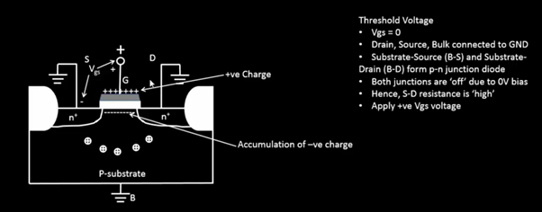

At first we will keep the Vgs=0, means source and drain terminal both are grounded. Body is also grounded. P-substrate and n+ act as PN junction diode, so there is a high resistance. There is no channel formation. For nmos we apply a positive Gate to source voltage. When the gate voltage is zero, no inversion channel exists between the source and drain. Both source-substrate and drain-substrate junctions remain unbiased, resulting in very high resistance between source and drain.

  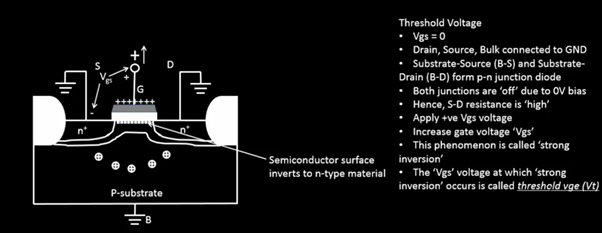

As the gate voltage (VGS) increases, electrons begin to accumulate beneath the gate oxide. At a particular gate voltage, the semiconductor surface under the gate inverts from p-type to n-type, resulting in the formation of an inversion channel between the source and drain. This minimum gate voltage required to create the conducting channel is called the threshold voltage (VTH). The formation of this inversion layer is known as strong inversion.

  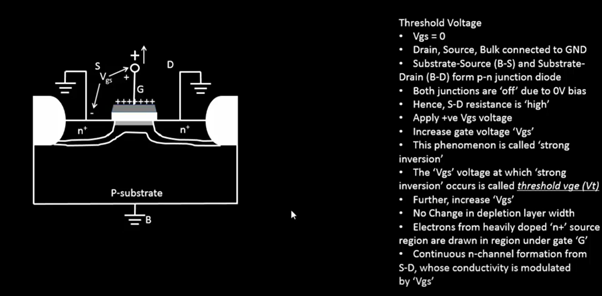

Further increase in gate voltage beyond the threshold voltage strengthens the inversion layer and forms a continuous n-channel between source and drain. The conductivity of this channel is controlled by the applied gate voltage.

<b>L3 - Strong inversion and threshold voltage</b>

  

  

  
Once the inversion channel is formed, any further increase in the gate voltage (VGS) attracts more electrons towards the gate-substrate interface, strengthening the n-type inversion layer. The region beneath the gate, which was originally part of the p-type substrate, effectively behaves as an n-type channel, providing a continuous conductive path between the source and drain. However, the formation of the channel alone does not result in current flow. A drain-to-source voltage (VDS) must be applied to create an electric field that drives electrons from the source towards the drain. Thus, VGS forms the channel, while VDS enables current conduction through the channel.

<b>L4 - Threshold voltage with positive substrate potential</b>

  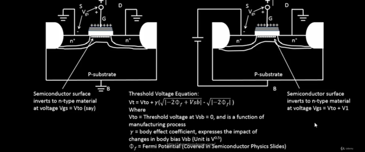

When VSB = 0, the inversion channel forms uniformly along the gate region once the gate voltage reaches the threshold voltage (VTO). As a result, channel formation occurs relatively earlier.

When a positive VSB is applied, the source-to-substrate junction becomes more reverse biased, increasing the depletion region width near the source. Due to this increased depletion charge, a higher gate voltage is required to attract sufficient electrons and create the inversion layer. Consequently, the threshold voltage increases from VTO to VTO + V1.

This phenomenon is known as the Body Effect, where the threshold voltage of a MOSFET increases with increasing source-to-body voltage (VSB).

  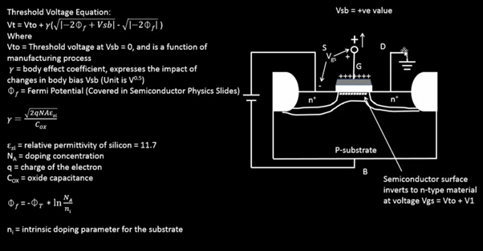

The threshold voltage is no longer constant and becomes a function of VSB. The body effect equation quantifies the increase in threshold voltage caused by the applied source-to-body bias, with parameters such as body-effect coefficient (γ) and Fermi potential (ϕF) determined by the manufacturing process.

---

### NgspiceSky130_D1SK2 - NMOS Resistive and Saturation Region

<b>L1 - Resistive region of operation with small drain-source voltage</b>

After the gate voltage (VGS) exceeds the threshold voltage (VTH), a continuous inversion channel is formed between the source and drain. This channel acts as a path through which electrons can travel.

Now let us apply a very small drain-to-source voltage (VDS), for example 0.05 V, while keeping VGS > VTH. Since the drain voltage is very small compared to the gate voltage, the voltage drop along the channel is also very small.

At the source end of the channel, the gate-to-channel voltage is approximately:
VGS - 0, because the channel voltage is nearly zero at the source.

  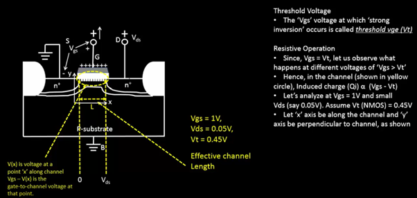

As we move towards the drain, the channel potential gradually increases from 0 V to VDS. Therefore, at any point x along the channel, the effective gate-to-channel voltage becomes:
VGS - V(x)
Since VDS is very small, the value of VGS − V(x) remains greater than the threshold voltage throughout the entire channel length. As a result, the inversion layer exists uniformly from source to drain.

Because the channel is continuous and almost uniform, it behaves like a resistor whose resistance is controlled by the gate voltage. Increasing VGS attracts more electrons into the channel, reducing its resistance. Decreasing VGS reduces the channel charge, increasing its resistance.

The movement of electrons occurs due to the electric field created by the small drain-to-source voltage. Since the channel behaves similarly to a resistor, the drain current increases approximately linearly with VDS.

This is why this region is called the Linear Region or Resistive Region of Operation.
### Key Observations
- A continuous inversion channel exists from source to drain.
- VDS is small compared to VGS.
- The channel charge is almost uniform throughout the channel.
- Drain current increases linearly with VDS.
- The MOSFET behaves like a voltage-controlled resistor.
- Increasing VGS reduces channel resistance and increases current flow.

### **Conclusion**

When VGS > VTH and VDS is small, the MOSFET operates in the resistive (linear) region. The channel is fully formed across the entire device length, and the drain current is approximately proportional to the applied drain voltage, making the transistor behave like a controllable resistor.

<b>L2 - Drift Current Theory</b>

In the previous section, we saw that when VGS > VTH and VDS is small, a continuous inversion channel is formed between the source and drain. However, the presence of a channel alone does not guarantee current flow. For current to flow, there must be a driving force that moves electrons from one end of the channel to the other.

At any point x along the channel, the channel potential is represented by V(x). Therefore, the effective gate-to-channel voltage at that point becomes:
VGS - V(x)

At the source end:
V(x) = 0

Therefore, VGS - V(x) = VGS At the drain end: V(x) = VDS

Therefore, VGS - V(x) = VGS - VDS
This shows that the gate-to-channel voltage is not constant throughout the channel. It gradually decreases from the source side to the drain side, creating a non-uniform charge distribution in the inversion layer.

  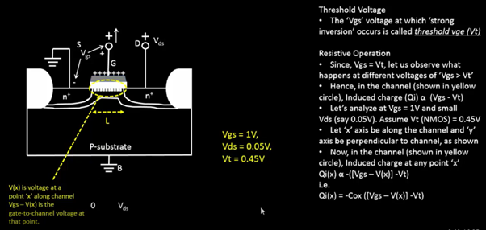

**Observation:**
The effective gate-to-channel voltage varies from VGS at the source to VGS − VDS at the drain. As a result, the inversion charge density is slightly higher near the source and lower near the drain.

To quantify the amount of charge available for conduction, we analyze the inversion charge density at any point x along the channel. The inversion charge depends on the gate oxide capacitance (Cox) and the local gate-to-channel voltage.

  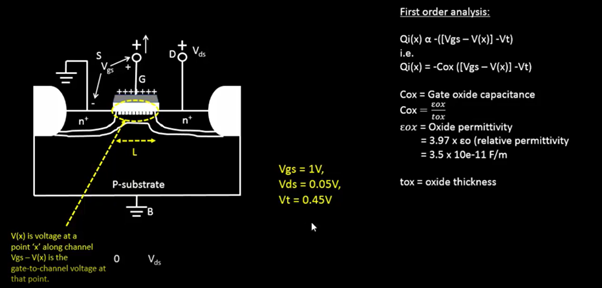

**Observation:**
A thinner oxide results in a larger oxide capacitance, allowing the gate to exert stronger control over the channel charge.

Now let us understand how current actually flows.

In semiconductor devices, there are two primary current transport mechanisms:

Drift Current
Diffusion Current

In a MOSFET operating in the linear region, the dominant current component is drift current.

Drift current arises due to the electric field created by the drain-to-source voltage (VDS). Since the channel potential changes from 0 V at the source to VDS at the drain, a potential gradient exists across the channel.

This potential gradient produces an electric field:
Electric Field = dV/dx
which drives electrons from the source towards the drain.

  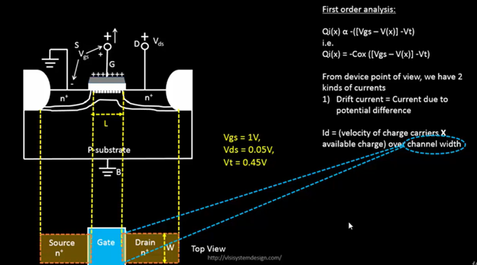

**Observation:**
The drift current exists because of the potential difference between source and drain. Without VDS, the channel would exist but no net electron flow would occur.

## The drain current can now be understood as the combined effect of:
- The amount of charge available in the channel.
- The velocity with which those charge carriers move

Mathematically,
Drain Current = Charge Density × Carrier Velocity × Channel Width
## Thus, the drain current increases when:
- More inversion charge is induced by increasing VGS.
- Carrier velocity increases due to a stronger electric field.
- Channel width (W) is increased.

## Key Observations
- The effective gate-to-channel voltage varies along the channel.
- Inversion charge density is maximum near the source and minimum near the drain.
- Oxide capacitance determines how effectively the gate controls channel charge.
- Drift current is caused by the electric field generated by VDS.
- Drain current depends on both carrier charge and carrier velocity.
- Increasing VGS increases inversion charge and hence drain current.

**Conclusion**

Although the inversion channel is formed by VGS, the actual current flow is driven by the electric field generated by VDS. This drift mechanism forms the basis for deriving the MOSFET drain current equations used in the linear and saturation regions of operation.

<b>L3 - Drain Current Model for Linear Region</b>

In the previous section, we learned that a small drain-to-source voltage (VDS) creates an electric field along the channel. This electric field causes electrons to move from the source towards the drain, producing a drift current.

When VGS > VTH, an inversion channel is already formed between the source and drain. The amount of charge present in this channel is not uniform and depends on the local gate-to-channel voltage at every point along the channel.

  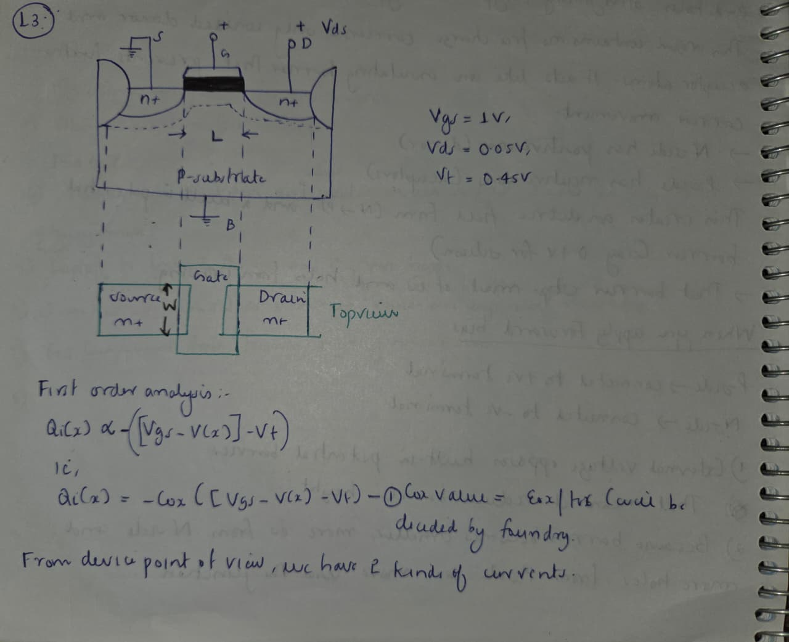

**Observation:**

At any point x along the channel, the inversion charge density depends on:
VGS - V(x)
Since the channel voltage gradually increases from the source to the drain, the available channel charge also varies along the channel length.
To calculate the drain current, we first determine the amount of inversion charge available at any point in the channel.

**Observation:**

The gate oxide acts like a capacitor. A larger oxide capacitance allows the gate to induce more charge in the channel, resulting in higher drain current.
## Now let us derive the drain current expression. From a device physics point of view, current depends on two things:
- The amount of charge available for conduction.
- The velocity with which those charges move.
Therefore, Drain Current = Charge × Velocity
The carrier velocity is proportional to the electric field inside the channel:
Velocity = Mobility × Electric Field
Since the electric field is created by the drain voltage, the drain current becomes dependent on both VGS and VDS.

By substituting the charge and velocity expressions and integrating across the entire channel length (L), we obtain the drain current equation:

  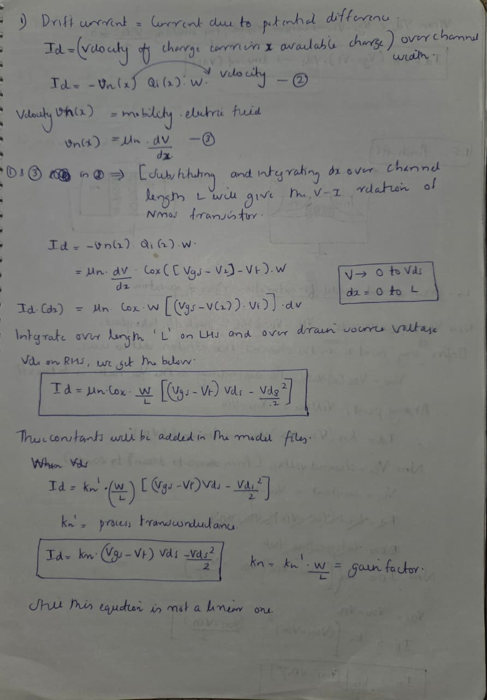

<b>L4 - SPICE conclusion to resistive operation</b>

So far, we have derived the drain current equation for the linear region and understood the physical behavior of the MOSFET. The next step is to verify whether the theoretical equations accurately predict the device behavior.

The drain current equation in the linear region is:
ID = kn[(VGS - VTH)VDS - VDS²/2]
This equation indicates that the drain current depends on both the gate voltage (VGS) and the drain voltage (VDS). To understand the effect of these parameters, we perform SPICE simulations by varying both voltages systematically.

The transistor threshold voltage is assumed to be:
Different gate voltages are selected:
VGS = 0.5V, 1V, 1.5V, 2V, 2.5V
The corresponding overdrive voltages become:
VGS - VTH = 0.05V, 0.55V, 1.05V, 1.55V, 2.05V
**Observation:**

For a transistor to remain in the linear (resistive) region, the following condition must be satisfied:
VDS < (VGS - VTH)
Therefore, for every selected value of VGS, the drain voltage can only be swept up to the corresponding (VGS − VTH) value while maintaining linear-region operation.
The objective of the simulation is to determine how the drain current changes with increasing drain voltage for different gate voltages. For each value of VGS, VDS is swept from 0 V up to (VGS − VTH) and the corresponding drain current is calculated using SPICE.

## This allows us to:
- Verify the linear-region drain current equation.
- Observe the dependence of drain current on gate voltage.
- Understand how increasing gate voltage strengthens the channel.
- Compare theoretical calculations with simulated results.

**Why SPICE Simulation?**

Performing these calculations manually for multiple combinations of VGS and VDS is time-consuming and prone to errors. SPICE automates this process by solving the device equations numerically and generating accurate current-voltage characteristics.

SPICE simulation is used to verify the drain current behavior predicted by the linear-region MOSFET model. By sweeping VDS for different values of VGS, we can observe how the drain current varies and confirm the validity of the theoretical drain current equation in the resistive region.

<b>L4 - Pinch-off region condition</b>
 

Imagine we have an NMOS transistor with:

VGS = 1 V. VTH = 0.45 V. Initially, let us keep VDS very small.

The effective channel voltage at any point is:

VGS - V(x)

For a channel to exist, this value must always be greater than the threshold voltage: VGS - V(x) > VTH.

As long as this condition is satisfied throughout the entire channel, electrons can travel continuously from source to drain.

  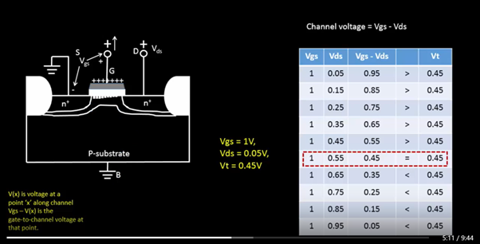

At first, when VDS = 0.05 V, VGS - VDS = 1 - 0.05 = 0.95 V

Since: 0.95 V > 0.45 V, the channel exists even near the drain.

Similarly, for:

VDS = 0.15 V

VDS = 0.25 V

VDS = 0.35 V

VDS = 0.45 V

the channel voltage remains greater than the threshold voltage. Therefore, a continuous inversion layer exists from source to drain. The MOSFET continues to operate in the linear (resistive) region.

Now let us gradually increase VDS. As VDS increases, the channel voltage near the drain keeps reducing because:

Channel Voltage = VGS - VDS

Eventually we reach: VGS - VDS = VTH Substituting values:

1 - VDS = 0.45 which gives: VDS = 0.55 V

  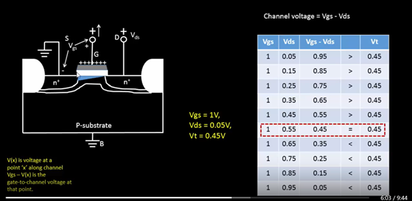

At this exact point, VGS - VDS = VTH 

The inversion charge at the drain end becomes almost zero. The conducting channel becomes extremely thin near the drain. This condition is called the Pinch-Off Point. The channel is just about to disappear near the drain.

If we further increase VDS beyond 0.55 V: VGS - VDS < VTH

For example:
VDS = 0.65 V. Then: VGS - VDS = 0.35 V which is less than VTH. Now there is no inversion layer near the drain side. 

  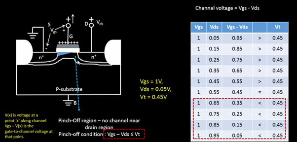

The channel is no longer continuous. A depletion region appears near the drain. This region is called the Pinch-Off Region. The condition for pinch-off is: VGS - VDS ≤ VTH

**If the channel is broken, why doesn't the current stop?**

This confuses almost everyone the first time. Imagine a river flowing through a narrow pipe. If the pipe suddenly becomes very narrow at one location, water does not stop flowing. Instead, the water accelerates through that narrow region. Something similar happens inside the MOSFET. Electrons travel from the source through the inversion channel. When they reach the pinch-off point, they enter a region having a very strong electric field created by the drain voltage. This electric field immediately sweeps the electrons into the drain.

## Therefore:
- Electrons still reach the drain.
- Current does not become zero.
- The pinch-off region simply grows larger as VDS increases.

**Why Does the Channel Voltage Become Constant?**

At the pinch-off point: VGS - V(x) = VTH

Rearranging: V(x) = VGS - VTH

Notice something interesting. 
## The right side contains only: 
- VGS
- VTH

Both are fixed values.Therefore:V(x) = Constant

This means the voltage at the pinch-off point cannot increase further. Any additional drain voltage applied beyond this point does not increase the channel voltage. Instead, it appears across the depletion region near the drain.

## As a result:
- Pinch-off point moves slightly towards the source.
- Depletion region widens.
- Drain current becomes almost independent of VDS.
This marks the beginning of the saturation region.

## Key Observations
- Channel exists only when VGS − V(x) > VTH.
- Increasing VDS reduces the channel voltage near the drain.
- Pinch-off occurs when VGS − VDS = VTH.
- Current does not stop after pinch-off.
- Electrons are swept through the depletion region by the strong electric field near the drain.
- Additional VDS increases the pinch-off region rather than increasing channel voltage.
- This is the starting point of MOSFET saturation operation.

**Conclusion**

As VDS increases, the inversion channel gradually becomes thinner near the drain. When the drain-end channel voltage falls to the threshold voltage, pinch-off occurs. Although the channel is no longer continuous, electrons continue to flow due to the strong electric field in the pinch-off region. This marks the transition from the linear region to the saturation region of MOSFET operation.

<b>L6 - Drain current model for saturation region of operation</b>

In the previous section, we learned that as the drain voltage (VDS) increases, the channel near the drain becomes thinner and thinner. Eventually, a point is reached where: VGS - VDS = VTH

At this condition, the inversion layer at the drain end disappears and the transistor enters the pinch-off condition. The corresponding drain voltage is: VDS(sat) = VGS - VTH

This marks the beginning of the saturation region.

  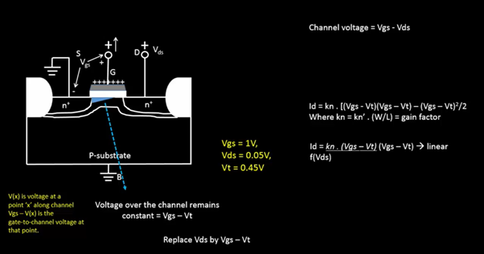

At pinch-off, the voltage across the conductive channel becomes fixed and equal to: VGS - VTH. Any additional drain voltage does not appear across the channel. Instead, it appears across the depletion region near the drain. 

  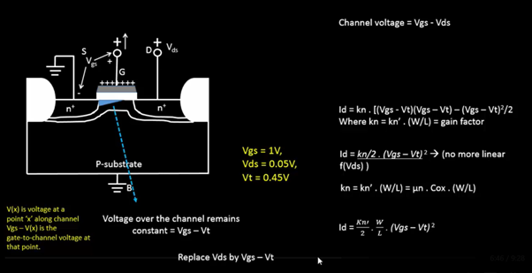

The drain current is no longer a function of VDS.

## Instead, it depends only on:

- Gate voltage (VGS)
- Threshold voltage (VTH)
- Device parameters (kn)

**Channel Length Modulation**

Let us increase VDS even further beyond saturation.

The drain-substrate junction is reverse biased. As the reverse bias increases, the depletion region near the drain expands.

This enlarged depletion region occupies part of the original channel.

This is why the current appears to become constant in the saturation region.

## As a result:

- Effective channel length decreases.
- Conductive channel becomes slightly shorter.
- Channel resistance decreases.
- Drain current increases slightly.

  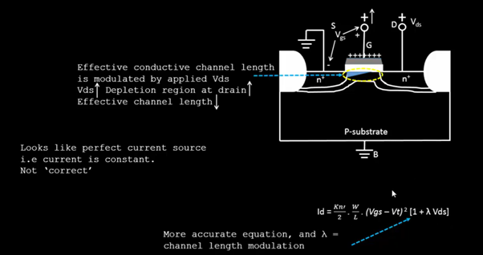

**Conclusion**

Once pinch-off occurs, the MOSFET enters the saturation region. The channel voltage becomes fixed at VGS − VTH, resulting in an almost constant drain current. However, due to channel length modulation, the effective channel length decreases as VDS increases, causing a small increase in drain current. This makes the practical saturation current slightly dependent on VDS, unlike the ideal MOSFET model.

---

### NgspiceSky130_D1SK3 - Introduction to SPICE

<b>L1 - Basic SPICE Setup</b>

Your notes here.

<b>L2 - Circuit Description in SPICE Syntax</b>

Your notes here.

<b>L3 - Technology Parameters</b>

Your notes here.

<b>L4 - First SPICE Simulation</b>

Your notes here.

