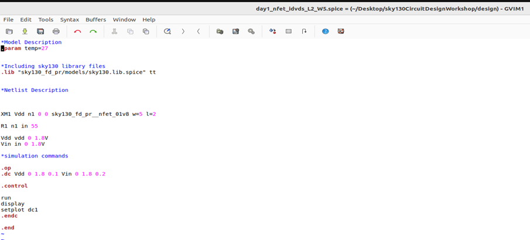
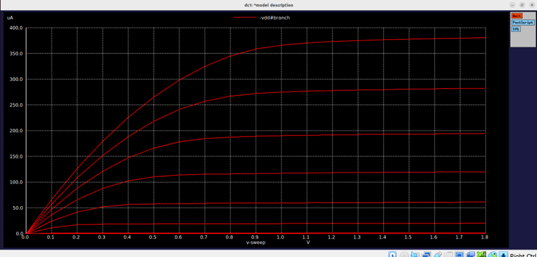
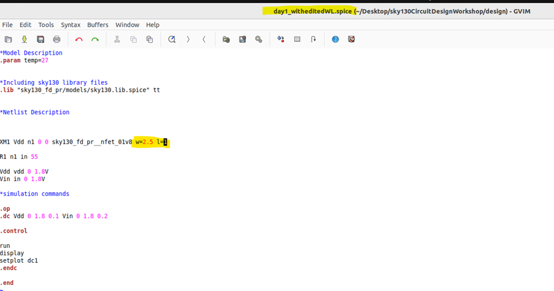
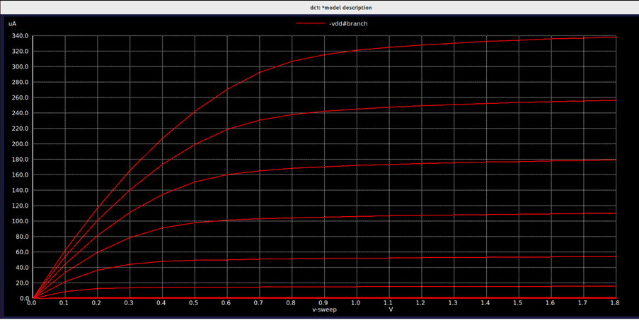

# CMOS-Circuit-Design-Spice-Simulations-VSDIAT

> This repository documents a hands-on CMOS circuit design workshop using the open-source SKY130 technology node. Over 10 intensive days, participants explore transistor-level modeling, SPICE-based simulations, and robustness analysis across process and voltage variations. Each module combines concise theory, guided simulations, and real-world design exercises, producing reproducible plots and verified design insights. The materials cover MOSFET physics, inverter characterization, noise-margin optimization, dynamic performance, and integration with open-source digital flows like OpenLane and VSDFlow, preparing learners for silicon-ready design.

---

## 📚 Table of Contents
1. [Mosfet Fundamental & Spice Setup](#mosfet-fundamental--spice-setup)
2. [Velocity saturation & CMOS Inverter Basics](#velocity-saturation--cmos-inverter-basics)
3. [Switching Threshold & Dynamic Behaviour](#switching-threshold--dynamic-behaviour)
4. [Noise-Margin Robustness  Analysis](#noise-margin-robustness-analysis)
5. [Power Supply & Process Variation Evaluation](#power-supply--pr0cess-variation-evaluation)

## 🛠️ Tools Used
## 🛠️ Tools Used

 
 
 
 

## 1️⃣ Mosfet Fundamental & Spice Setup

### NgspiceSky130_D1SK1 - Introduction to Circuit Design and SPICE Simulations

<b>L1 - Why do we need SPICE Simulations?</b>

SPICE simulations are used to analyze and verify circuit behavior before fabrication by applying input signals and observing outputs. They help designers evaluate parameters like voltage, current, delay, power, and noise margins, reducing design errors and improving circuit reliability.

SPICE simulations help evaluate circuit performance across a large number of operating points and conditions. They provide accurate values for parameters such as voltage, current, delay, and power, which would be difficult and time-consuming to calculate manually.

<b>L2-Introduction to basic element in circuit design-NMOS</b>

At first we will keep the Vgs=0, means source and drain terminal both are grounded. Body is also grounded. P-substrate and n+ act as PN junction diode, so there is a high resistance. There is no channel formation. For nmos we apply a positive Gate to source voltage. When the gate voltage is zero, no inversion channel exists between the source and drain. Both source-substrate and drain-substrate junctions remain unbiased, resulting in very high resistance between source and drain.

As the gate voltage (VGS) increases, electrons begin to accumulate beneath the gate oxide. At a particular gate voltage, the semiconductor surface under the gate inverts from p-type to n-type, resulting in the formation of an inversion channel between the source and drain. This minimum gate voltage required to create the conducting channel is called the threshold voltage (VTH). The formation of this inversion layer is known as strong inversion.

Further increase in gate voltage beyond the threshold voltage strengthens the inversion layer and forms a continuous n-channel between source and drain. The conductivity of this channel is controlled by the applied gate voltage.

<b>L3 - Strong inversion and threshold voltage</b>

 

  
Once the inversion channel is formed, any further increase in the gate voltage (VGS) attracts more electrons towards the gate-substrate interface, strengthening the n-type inversion layer. The region beneath the gate, which was originally part of the p-type substrate, effectively behaves as an n-type channel, providing a continuous conductive path between the source and drain. However, the formation of the channel alone does not result in current flow. A drain-to-source voltage (VDS) must be applied to create an electric field that drives electrons from the source towards the drain. Thus, VGS forms the channel, while VDS enables current conduction through the channel.

<b>L4 - Threshold voltage with positive substrate potential</b>

When VSB = 0, the inversion channel forms uniformly along the gate region once the gate voltage reaches the threshold voltage (VTO). As a result, channel formation occurs relatively earlier.

When a positive VSB is applied, the source-to-substrate junction becomes more reverse biased, increasing the depletion region width near the source. Due to this increased depletion charge, a higher gate voltage is required to attract sufficient electrons and create the inversion layer. Consequently, the threshold voltage increases from VTO to VTO + V1.

This phenomenon is known as the Body Effect, where the threshold voltage of a MOSFET increases with increasing source-to-body voltage (VSB).

The threshold voltage is no longer constant and becomes a function of VSB. The body effect equation quantifies the increase in threshold voltage caused by the applied source-to-body bias, with parameters such as body-effect coefficient (γ) and Fermi potential (ϕF) determined by the manufacturing process.

---

### NgspiceSky130_D1SK2 - NMOS Resistive and Saturation Region

<b>L1 - Resistive region of operation with small drain-source voltage</b>

After the gate voltage (VGS) exceeds the threshold voltage (VTH), a continuous inversion channel is formed between the source and drain. This channel acts as a path through which electrons can travel.

Now let us apply a very small drain-to-source voltage (VDS), for example 0.05 V, while keeping VGS > VTH. Since the drain voltage is very small compared to the gate voltage, the voltage drop along the channel is also very small.

At the source end of the channel, the gate-to-channel voltage is approximately:
VGS - 0, because the channel voltage is nearly zero at the source.

As we move towards the drain, the channel potential gradually increases from 0 V to VDS. Therefore, at any point x along the channel, the effective gate-to-channel voltage becomes:
VGS - V(x)
Since VDS is very small, the value of VGS − V(x) remains greater than the threshold voltage throughout the entire channel length. As a result, the inversion layer exists uniformly from source to drain.

Because the channel is continuous and almost uniform, it behaves like a resistor whose resistance is controlled by the gate voltage. Increasing VGS attracts more electrons into the channel, reducing its resistance. Decreasing VGS reduces the channel charge, increasing its resistance.

The movement of electrons occurs due to the electric field created by the small drain-to-source voltage. Since the channel behaves similarly to a resistor, the drain current increases approximately linearly with VDS.

This is why this region is called the Linear Region or Resistive Region of Operation.
### Key Observations
- A continuous inversion channel exists from source to drain.
- VDS is small compared to VGS.
- The channel charge is almost uniform throughout the channel.
- Drain current increases linearly with VDS.
- The MOSFET behaves like a voltage-controlled resistor.
- Increasing VGS reduces channel resistance and increases current flow.

### **Conclusion**

When VGS > VTH and VDS is small, the MOSFET operates in the resistive (linear) region. The channel is fully formed across the entire device length, and the drain current is approximately proportional to the applied drain voltage, making the transistor behave like a controllable resistor.

<b>L2 - Drift Current Theory</b>

In the previous section, we saw that when VGS > VTH and VDS is small, a continuous inversion channel is formed between the source and drain. However, the presence of a channel alone does not guarantee current flow. For current to flow, there must be a driving force that moves electrons from one end of the channel to the other.

At any point x along the channel, the channel potential is represented by V(x). Therefore, the effective gate-to-channel voltage at that point becomes:
VGS - V(x)

At the source end:
V(x) = 0

Therefore, VGS - V(x) = VGS At the drain end: V(x) = VDS

Therefore, VGS - V(x) = VGS - VDS
This shows that the gate-to-channel voltage is not constant throughout the channel. It gradually decreases from the source side to the drain side, creating a non-uniform charge distribution in the inversion layer.

**Observation:**
The effective gate-to-channel voltage varies from VGS at the source to VGS − VDS at the drain. As a result, the inversion charge density is slightly higher near the source and lower near the drain.

To quantify the amount of charge available for conduction, we analyze the inversion charge density at any point x along the channel. The inversion charge depends on the gate oxide capacitance (Cox) and the local gate-to-channel voltage.

**Observation:**
A thinner oxide results in a larger oxide capacitance, allowing the gate to exert stronger control over the channel charge.

Now let us understand how current actually flows.

In semiconductor devices, there are two primary current transport mechanisms:

Drift Current
Diffusion Current

In a MOSFET operating in the linear region, the dominant current component is drift current.

Drift current arises due to the electric field created by the drain-to-source voltage (VDS). Since the channel potential changes from 0 V at the source to VDS at the drain, a potential gradient exists across the channel.

This potential gradient produces an electric field:
Electric Field = dV/dx
which drives electrons from the source towards the drain

**Observation:**
The drift current exists because of the potential difference between source and drain. Without VDS, the channel would exist but no net electron flow would occur.

## The drain current can now be understood as the combined effect of:
- The amount of charge available in the channel.
- The velocity with which those charge carriers move

Mathematically,
Drain Current = Charge Density × Carrier Velocity × Channel Width
## Thus, the drain current increases when:
- More inversion charge is induced by increasing VGS.
- Carrier velocity increases due to a stronger electric field.
- Channel width (W) is increased.

## Key Observations
- The effective gate-to-channel voltage varies along the channel.
- Inversion charge density is maximum near the source and minimum near the drain.
- Oxide capacitance determines how effectively the gate controls channel charge.
- Drift current is caused by the electric field generated by VDS.
- Drain current depends on both carrier charge and carrier velocity.
- Increasing VGS increases inversion charge and hence drain current.

**Conclusion**

Although the inversion channel is formed by VGS, the actual current flow is driven by the electric field generated by VDS. This drift mechanism forms the basis for deriving the MOSFET drain current equations used in the linear and saturation regions of operation.

<b>L3 - Drain Current Model for Linear Region</b>

In the previous section, we learned that a small drain-to-source voltage (VDS) creates an electric field along the channel. This electric field causes electrons to move from the source towards the drain, producing a drift current.

When VGS > VTH, an inversion channel is already formed between the source and drain. The amount of charge present in this channel is not uniform and depends on the local gate-to-channel voltage at every point along the channel.

**Observation:**

At any point x along the channel, the inversion charge density depends on:
VGS - V(x)
Since the channel voltage gradually increases from the source to the drain, the available channel charge also varies along the channel length.
To calculate the drain current, we first determine the amount of inversion charge available at any point in the channel.

**Observation:**

The gate oxide acts like a capacitor. A larger oxide capacitance allows the gate to induce more charge in the channel, resulting in higher drain current.
## Now let us derive the drain current expression. From a device physics point of view, current depends on two things:
- The amount of charge available for conduction.
- The velocity with which those charges move.
Therefore, Drain Current = Charge × Velocity
The carrier velocity is proportional to the electric field inside the channel:
Velocity = Mobility × Electric Field
Since the electric field is created by the drain voltage, the drain current becomes dependent on both VGS and VDS.

By substituting the charge and velocity expressions and integrating across the entire channel length (L), we obtain the drain current equation:

<b>L4 - SPICE conclusion to resistive operation</b>

So far, we have derived the drain current equation for the linear region and understood the physical behavior of the MOSFET. The next step is to verify whether the theoretical equations accurately predict the device behavior.

The drain current equation in the linear region is:
ID = kn[(VGS - VTH)VDS - VDS²/2]
This equation indicates that the drain current depends on both the gate voltage (VGS) and the drain voltage (VDS). To understand the effect of these parameters, we perform SPICE simulations by varying both voltages systematically.

The transistor threshold voltage is assumed to be:
Different gate voltages are selected:
VGS = 0.5V, 1V, 1.5V, 2V, 2.5V
The corresponding overdrive voltages become:
VGS - VTH = 0.05V, 0.55V, 1.05V, 1.55V, 2.05V
**Observation:**

For a transistor to remain in the linear (resistive) region, the following condition must be satisfied:
VDS < (VGS - VTH)
Therefore, for every selected value of VGS, the drain voltage can only be swept up to the corresponding (VGS − VTH) value while maintaining linear-region operation.
The objective of the simulation is to determine how the drain current changes with increasing drain voltage for different gate voltages. For each value of VGS, VDS is swept from 0 V up to (VGS − VTH) and the corresponding drain current is calculated using SPICE.

## This allows us to:
- Verify the linear-region drain current equation.
- Observe the dependence of drain current on gate voltage.
- Understand how increasing gate voltage strengthens the channel.
- Compare theoretical calculations with simulated results.

**Why SPICE Simulation?**

Performing these calculations manually for multiple combinations of VGS and VDS is time-consuming and prone to errors. SPICE automates this process by solving the device equations numerically and generating accurate current-voltage characteristics.

SPICE simulation is used to verify the drain current behavior predicted by the linear-region MOSFET model. By sweeping VDS for different values of VGS, we can observe how the drain current varies and confirm the validity of the theoretical drain current equation in the resistive region.

<b>L4 - Pinch-off region condition</b>
 

Imagine we have an NMOS transistor with:

VGS = 1 V. VTH = 0.45 V. Initially, let us keep VDS very small.

The effective channel voltage at any point is:

VGS - V(x)

For a channel to exist, this value must always be greater than the threshold voltage: VGS - V(x) > VTH.

As long as this condition is satisfied throughout the entire channel, electrons can travel continuously from source to drain.

At first, when VDS = 0.05 V, VGS - VDS = 1 - 0.05 = 0.95 V

Since: 0.95 V > 0.45 V, the channel exists even near the drain.

Similarly, for:

VDS = 0.15 V

VDS = 0.25 V

VDS = 0.35 V

VDS = 0.45 V

the channel voltage remains greater than the threshold voltage. Therefore, a continuous inversion layer exists from source to drain. The MOSFET continues to operate in the linear (resistive) region.

Now let us gradually increase VDS. As VDS increases, the channel voltage near the drain keeps reducing because:

Channel Voltage = VGS - VDS

Eventually we reach: VGS - VDS = VTH Substituting values:

1 - VDS = 0.45 which gives: VDS = 0.55 V

At this exact point, VGS - VDS = VTH 

The inversion charge at the drain end becomes almost zero. The conducting channel becomes extremely thin near the drain. This condition is called the Pinch-Off Point. The channel is just about to disappear near the drain.

If we further increase VDS beyond 0.55 V: VGS - VDS < VTH

For example:
VDS = 0.65 V. Then: VGS - VDS = 0.35 V which is less than VTH. Now there is no inversion layer near the drain side. 

The channel is no longer continuous. A depletion region appears near the drain. This region is called the Pinch-Off Region. The condition for pinch-off is: VGS - VDS ≤ VTH

**If the channel is broken, why doesn't the current stop?**

This confuses almost everyone the first time. Imagine a river flowing through a narrow pipe. If the pipe suddenly becomes very narrow at one location, water does not stop flowing. Instead, the water accelerates through that narrow region. Something similar happens inside the MOSFET. Electrons travel from the source through the inversion channel. When they reach the pinch-off point, they enter a region having a very strong electric field created by the drain voltage. This electric field immediately sweeps the electrons into the drain.

## Therefore:
- Electrons still reach the drain.
- Current does not become zero.
- The pinch-off region simply grows larger as VDS increases.

**Why Does the Channel Voltage Become Constant?**

At the pinch-off point: VGS - V(x) = VTH

Rearranging: V(x) = VGS - VTH

Notice something interesting. 
## The right side contains only: 
- VGS
- VTH

Both are fixed values.Therefore:V(x) = Constant

This means the voltage at the pinch-off point cannot increase further. Any additional drain voltage applied beyond this point does not increase the channel voltage. Instead, it appears across the depletion region near the drain.

## As a result:
- Pinch-off point moves slightly towards the source.
- Depletion region widens.
- Drain current becomes almost independent of VDS.
This marks the beginning of the saturation region.

## Key Observations
- Channel exists only when VGS − V(x) > VTH.
- Increasing VDS reduces the channel voltage near the drain.
- Pinch-off occurs when VGS − VDS = VTH.
- Current does not stop after pinch-off.
- Electrons are swept through the depletion region by the strong electric field near the drain.
- Additional VDS increases the pinch-off region rather than increasing channel voltage.
- This is the starting point of MOSFET saturation operation.

**Conclusion**

As VDS increases, the inversion channel gradually becomes thinner near the drain. When the drain-end channel voltage falls to the threshold voltage, pinch-off occurs. Although the channel is no longer continuous, electrons continue to flow due to the strong electric field in the pinch-off region. This marks the transition from the linear region to the saturation region of MOSFET operation.

<b>L6 - Drain current model for saturation region of operation</b>

In the previous section, we learned that as the drain voltage (VDS) increases, the channel near the drain becomes thinner and thinner. Eventually, a point is reached where: VGS - VDS = VTH

At this condition, the inversion layer at the drain end disappears and the transistor enters the pinch-off condition. The corresponding drain voltage is: VDS(sat) = VGS - VTH

This marks the beginning of the saturation region.

At pinch-off, the voltage across the conductive channel becomes fixed and equal to: VGS - VTH. Any additional drain voltage does not appear across the channel. Instead, it appears across the depletion region near the drain.

The drain current is no longer a function of VDS.

## Instead, it depends only on:

- Gate voltage (VGS)
- Threshold voltage (VTH)
- Device parameters (kn)

**Channel Length Modulation**

Let us increase VDS even further beyond saturation.

The drain-substrate junction is reverse biased. As the reverse bias increases, the depletion region near the drain expands.

This enlarged depletion region occupies part of the original channel.

This is why the current appears to become constant in the saturation region.

## As a result:

- Effective channel length decreases.
- Conductive channel becomes slightly shorter.
- Channel resistance decreases.
- Drain current increases slightly.

**Conclusion**

Once pinch-off occurs, the MOSFET enters the saturation region. The channel voltage becomes fixed at VGS − VTH, resulting in an almost constant drain current. However, due to channel length modulation, the effective channel length decreases as VDS increases, causing a small increase in drain current. This makes the practical saturation current slightly dependent on VDS, unlike the ideal MOSFET model.

---

### NgspiceSky130_D1SK3 - Introduction to SPICE

<b>L1 - Basic SPICE Setup</b>

So far, we have understood how an NMOS transistor behaves physically. We studied channel formation, linear region operation, saturation, pinch-off, and channel length modulation.

Now imagine that we want to predict the behavior of a transistor before manufacturing it. Calculating every voltage and current manually would be extremely difficult, especially when a modern chip contains millions of transistors.

This is where SPICE comes into the picture.

SPICE (Simulation Program with Integrated Circuit Emphasis) acts like a virtual laboratory. Instead of fabricating the transistor and then testing it, we can simulate its behavior on a computer.

SPICE takes two important inputs:

- The circuit description (SPICE Netlist)
- Technology parameters provided by the foundry

Using these inputs, SPICE solves the transistor equations and predicts the electrical behavior of the circuit.

Think of SPICE as a calculator that already knows all the complicated transistor physics and performs the calculations automatically.

**What are Nodes in SPICE?**

Before SPICE can analyze a circuit, it must know how every component is connected.

For this purpose, every connection point is assigned a name called a Node.

For example:

- VDD
- VSS
- IN
- OUT
- n1

Each node represents a unique electrical connection point.

When SPICE runs a simulation, it calculates the voltage at every node and determines how current flows between them.

Without nodes, SPICE would not know how the circuit is interconnected.

<b>L2 - Circuit Description in SPICE Syntax</b>
 

Once the nodes are defined, we must tell SPICE what components are present in the circuit.

Unlike schematic diagrams, SPICE uses text-based commands.

As shown in the figure, the transistor, resistor, and voltage source are described using simple statements.

For example:M1 vdd n1 0 0 nmos W=1.8u L=1.2u

This tells SPICE:

- M1 is an NMOS transistor
- Drain connected to vdd
- Gate connected to n1
- Source connected to ground
- Bulk connected to ground
- Width = 1.8 μm
- Length = 1.2 μm

Similarly, **R1 in n1 55** defines a resistor and **Vdd vdd 0 2.5** defines a 2.5 V supply source.

Together, these statements form the SPICE Netlist, which is simply a textual description of the circuit.

<b>L3 - Technology Parameters</b>

Describing the circuit connections alone is not enough.

SPICE also needs to know how the transistor behaves physically.

For example:

- What is the threshold voltage?
- What is the electron mobility?
- What is the oxide thickness?
- What is the body effect coefficient?

These values are technology-dependent and are provided by the semiconductor foundry.

You can think of this model as the transistor's DNA. It completely defines how the transistor behaves electrically.

Instead of writing hundreds of model parameters inside every circuit file, all these parameters are grouped into a separate model file.

As shown in the figure, the technology file may contain:

- NMOS model parameters
- PMOS model parameters
- Threshold voltage values
- Body effect coefficients
- Oxide parameters
- Mobility parameters

xxxx_025um_model.mod

Whenever SPICE runs, it reads this file and uses these parameters to accurately model transistor behavior.

These are packaged into a model file such as:

Once the circuit netlist and technology file are ready, we connect them together. As shown in the above figure, the simulation file includes:

- Circuit description
- Technology model file
- Simulation commands

At this point SPICE has all the information required to start the simulation.

<b>L4 - First SPICE Simulation</b>

Now the simulation is executed.

SPICE begins by reading the netlist and technology file.

It then solves the transistor equations internally and calculates:

- Node voltages
- Branch currents
- Device operating points

As shown in teh figure, the simulator successfully processes the circuit and displays the simulation information in the terminal.

This confirms that the circuit description and model files have been read correctl

After simulation, SPICE generates several output vectors.  

- Node voltages
- Drain current
- Branch currents
- Operating point values

These are the numerical results produced by the simulator.

Finally, SPICE plots the ID-VDS characteristics of the NMOS transistor.

The graph shows drain current versus drain voltage for multiple gate voltages.

Instead of manually calculating drain current for every VDS value, SPICE automatically sweeps the voltage and generates the complete curve.

This is one of the biggest advantages of simulation.

**Why is the Plot Command Written as -vdd#branch?**

A common question is why the current is plotted as: -vdd#branch instead of vdd#branch 

The reason is SPICE's current sign convention. SPICE assumes that current entering the positive terminal of a voltage source is positive. However, in our NMOS circuit, current actually leaves the positive terminal of VDD and flows toward ground. Therefore, SPICE reports the current as negative. To display the drain current in the actual direction of flow, we add a negative sign:**-vdd#branch**

## 2️⃣ Velocity Saturation & CMOS Inverter Basics

### NgspiceSky130-Day2-Velocity saturation and basics of CMOS inverter VTC

<b>L1 - L1 SPICE simulation for lower nodes?</b>

After understanding how an NMOS behaves in the linear and saturation regions, the next step is to see how device dimensions affect its electrical characteristics.

To study this, we perform SPICE simulations using a lower technology node transistor. The objective is to observe how the drain current characteristics change when the transistor dimensions are modified.

  

we create an NMOS transistor in the SPICE netlist with a Width-to-Length ratio (W/L) of 2.5. The simulation sweeps the drain voltage while applying different gate voltages. Here the meaning of **.dc Vdd 0 1.8 0.1 Vin 0 1.8 0.2** means Vdd will be swept from 0 to 1.8 for each value of Vin from 0 to 1.8. That means first Vin=0, then Vdd will be 0,0.1,0.2.....,1.8. 

The SPICE simulator then calculates the drain current for each operating condition and generates the characteristic curves automatically. This allows us to study transistor behavior without performing lengthy manual calculations.

  

The output graph in the figure, shows the drain current versus drain voltage characteristics for different gate voltages.

At small drain voltages, the curves rise almost linearly because the transistor operates in the resistive region.

As the drain voltage increases further, the curves gradually flatten, indicating that the transistor has entered saturation. In this region, increasing VDS does not significantly increase the drain current.

  

  

In the previous case, the characteristics were obtained for a long-channel MOSFET. The region left of **VDS = VGS − VT** is the **Linear Region**, the region right of it is the **Saturation Region**, and the area below threshold is the **Cut-off Region**.

Now, both **W** and **L** are scaled down while keeping the **W/L ratio constant**. From the ideal drain current equation, the current should remain unchanged since it depends on **W/L**. However, practical SPICE simulations show a different behavior due to short-channel effects present in scaled technologies.

The SPICE deck below demonstrates this comparison, where only **W** and **L** are changed while all other parameters remain the same.

<b>L2 - Drain current vs gate voltage for long and short channel device?</b>

Up to now, the drain current equations that we studied for MOSFETs suggested that the drain current in saturation is proportional to the square of the overdrive voltage (VGS − VT). This means that if we increase the gate voltage, the drain current should increase quadratically. To verify this behavior, simulations were performed on both long-channel and short-channel devices.
 

The drain current characteristics of a long-channel MOSFET were first analyzed. From the graph, it can be observed that the drain current increases slowly at lower gate voltages and rises rapidly as the gate voltage increases further. This behavior follows the classical square-law relationship of MOSFETs. The curved nature of the graph clearly indicates this quadratic dependence.

However, when we look at the short-channel device, a different behavior starts to appear. Initially, for lower values of gate voltage, the current still follows the expected quadratic relationship. But as the gate voltage continues to increase, the drain current starts becoming almost linearly dependent on VGS. This can be observed from the nearly constant spacing between adjacent current curves. Instead of increasing rapidly according to the square law, the current begins increasing at a more constant rate.

The important takeaway is:
- Long-channel MOSFET → Drain current follows quadratic dependence on VGS.
- Short-channel MOSFET → Initially quadratic, then gradually becomes linear with increasing VGS.

This difference becomes very important in modern technologies where transistor lengths are extremely small.

To observe this behavior more clearly, a simulation was set up where the drain voltage was kept constant at 2.5 V while the gate voltage was swept from 0 V to 2.5 V. The objective was to directly plot the relationship between drain current and gate voltage.

The corresponding SPICE setup used for the simulation is shown above. The gate voltage was varied while monitoring the drain current. This allows us to visualize how the current responds to changes in gate bias.

This figure shows the simulation execution and extraction of the required current parameters from NGSPICE.

The resulting graph for a long-channel device clearly resembles a parabola, confirming that drain current is proportional to the square of the gate overdrive voltage. The graph is clearly quadratic and matches the long-channel MOSFET current equation.

Next, the same experiment was repeated for a short-channel MOSFET. Only the device dimensions were changed to represent a short-channel transistor while keeping the same analysis procedure.

Unlike the previous graph, this curve is almost linear after the threshold region. Instead of rising quadratically, the drain current increases nearly proportionally with gate voltage. This observation indicates that an additional physical effect is limiting the current growth in short-channel devices.

<b>L3-Velocity saturation at lower and higher electric fields</b>

At this point, an important question arises.

If the drain current equation predicts quadratic growth, why does the short-channel device show almost linear behavior?

The answer lies in a phenomenon called Velocity Saturation.

To understand velocity saturation, let us recall that electrons move through the channel because of the electric field created between source and drain. Electron velocity can be expressed as:

v = μnE

where μn is the electron mobility and E is the electric field.

This equation tells us that electron velocity should increase linearly with electric field. This assumption is valid only at lower electric fields.

This figure compares long-channel and short-channel devices. The long-channel device continues to exhibit quadratic current growth, whereas the short-channel device begins transitioning toward linear behavior.

At lower electric fields, electron velocity increases almost linearly with the electric field according to the mobility equation.

However, electrons cannot keep accelerating forever. As the electric field becomes very large, electrons experience more collisions with the silicon lattice. These collisions are called scattering effects.

As electric field increases further, the electron velocity gradually approaches a maximum value and stops increasing significantly.

The graph clearly shows two regions:

- Low electric field region → Velocity increases linearly.
- High electric field region → Velocity becomes almost constant.

This constant velocity region is known as velocity saturation.

A mathematical model is introduced to smoothly represent the transition from linear velocity behavior to saturation velocity behavior.

This model ensures continuity between both operating regions and accurately represents carrier transport at higher electric fields.

Because short-channel devices have very small channel lengths, even moderate drain voltages can create extremely high electric fields. Therefore, electrons quickly reach their saturation velocity.

Once the velocity becomes constant, increasing gate voltage can no longer increase current according to the square-law relationship. As a result, the drain current begins to show a more linear dependence on gate voltage rather than a quadratic dependence.

This is the fundamental reason why short-channel MOSFETs deviate from classical long-channel equations.

Using the velocity saturation expression, the drain current equation can be re-derived. The resulting equation becomes much more accurate for short-channel technologies, although it is more difficult to use for manual calculations.

This figure summarizes the operating regions:

- Long Channel → Cutoff, Linear, Saturation
- Short Channel → Cutoff, Linear, Velocity Saturation, Saturation

Velocity saturation becomes an additional operating behavior that is particularly important in deep submicron technologies.

## Key Observations
- Long-channel MOSFETs follow the classical square-law current model.
- Short-channel MOSFETs gradually deviate from the square-law model.
- Carrier velocity increases linearly only at lower electric fields.
- At higher electric fields, carrier velocity reaches a maximum saturation value.
- Velocity saturation limits drain current growth in modern technologies.
-This effect causes the drain current characteristics of short-channel devices to become nearly linear.
**Conclusion**

The classical MOSFET current equations accurately describe long-channel devices, where drain current varies approximately as the square of the gate overdrive voltage. However, as transistor dimensions shrink, extremely high electric fields develop inside the channel. These high fields cause electron velocity to saturate due to scattering effects. Once velocity saturation occurs, the drain current can no longer increase quadratically and instead begins showing a nearly linear dependence on gate voltage. This explains the differences observed between long-channel and short-channel MOSFET characteristics and highlights why modern technologies require more advanced current models than the traditional square-law equations.

<b>L4 - Velocity saturation drain current model</b>

 
In the previous section, we learned that short-channel MOSFETs no longer follow the ideal square-law relationship because the carriers eventually reach their saturation velocity. This naturally raises an important question: if the classical drain current equation is no longer accurate, how can we model the current of short-channel devices?

To answer this question, a velocity saturation based drain current model is introduced. Unlike the classical MOSFET equation, this model takes into account the fact that carrier velocity cannot increase indefinitely. At lower electric fields, the current still behaves similarly to the long-channel model. However, once velocity saturation begins, the current growth slows down and becomes more linear.

- There are three possible cases depending on which parameter is the minimum among (V_{GT}), (V_{DS}), and (V_{DSAT}).
- When (V_{GT}) is the minimum ((V_{GT} < V_{DS}) and (V_{GT} < V_{DSAT})), the minimum-function model selects (V_{GT}) as (V_{min}). Substituting (V_{min} = V_{GT}) into the drain current equation results in a current expression that becomes independent of (V_{DS}), giving a nearly constant drain current.
- Physically, saturation occurs when the drain voltage is sufficiently large such that further increases in (V_{DS}) do not significantly increase the drain current. Since (V_{DS}) is already greater than the limiting voltage (V_{GT}), the channel reaches pinch-off and the device operates in the saturation region.
- Therefore, for both long-channel and short-channel devices, the condition where (V_{GT}) is the minimum parameter indicates saturation operation, as the drain current has reached its limiting value and is no longer controlled by (VDS)

There are three possible cases depending on which parameter is the minimum among Vgt, Vds, and Vdsat.

  When Vgt is the minimum (Vgt < Vds and Vgt < Vdsat), the minimum-function model selects Vgt as Vmin. Substituting Vmin = Vgt into the drain current equation results in a current expression that becomes independent of Vds, giving a nearly constant drain current.

  Physically, saturation occurs when the drain voltage is sufficiently large such that further increases in Vds do not significantly increase the drain current. Since Vds is already greater than the limiting voltage Vgt, the channel reaches pinch-off and the device operates in the saturation region.

  Therefore, for both long-channel and short-channel devices, the condition where Vgt is the minimum parameter indicates saturation operation, as the drain current has reached its limiting value and is no longer controlled by Vds.

When Vds is the minimum parameter (Vds < Vgt and Vds < Vdsat), the minimum-function model selects Vds as Vmin. This corresponds to the condition where the drain-to-source voltage is relatively small compared to the gate overdrive voltage.

  Substituting Vmin = Vds into the drain current equation and considering low Vds, the channel-length modulation term 1 + λVds becomes approximately unity, since λVds << 1. Under this condition, the drain current varies nearly linearly with Vds.

  As a result, the current equation reduces to the familiar linear (or triode) region expression. Therefore, when Vds is the minimum parameter, the device operates in the linear region, where the channel is formed along the entire length and the drain current is controlled by both Vgs and Vds.

  

Peak current in a short-channel MOSFET is lower than that of a long-channel MOSFET due to velocity saturation.

  In a long-channel MOSFET, pinch-off occurs at a relatively higher Vds because the channel length is larger. Before pinch-off, carriers continue to accelerate as the electric field increases, resulting in a higher drain current.

  In a short-channel MOSFET, pinch-off occurs at a much lower Vds because the channel length is small. Once pinch-off occurs, channel length modulation begins, causing the effective channel length to reduce as Vds increases.

  Although the depletion region near the drain continues to widen and the electric field continues to increase with increasing Vds, the carrier velocity cannot increase indefinitely. Beyond a critical electric field, electrons reach their saturation velocity.

  As a result, further increases in Vds do not produce a proportional increase in carrier velocity. Since the drain current depends on carrier velocity, the current increase becomes limited.

  Therefore, even though channel length modulation tends to increase drain current, velocity saturation restricts the carrier velocity, resulting in a lower peak drain current in short-channel MOSFETs compared to long-channel MOSFETs.

<b>L5 - Labs Sky130 Id-Vgs</b>

Now we can show the graphs between short channel & long channel mosfets. Mosfets with width less than 250 microns are called as short channel mosfet.

Eventhough the starting Id has a quadratic dependency on Vgs. But later it became linear. Now Vdd is kept constant at 1.8V Vgs is increased from 0 to 1.8. The graph is almost linear. 

<b>L6 - Labs Sky130 Vt</b>

To get the threshold voltage, take the slope over the Vgs vs Id graph. It comes to apprx 0.77 Volts.

